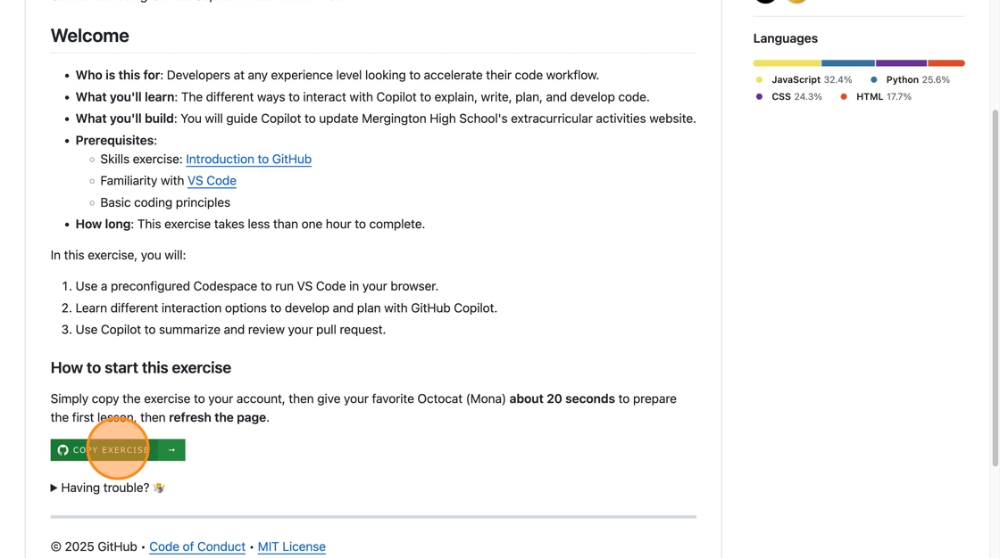
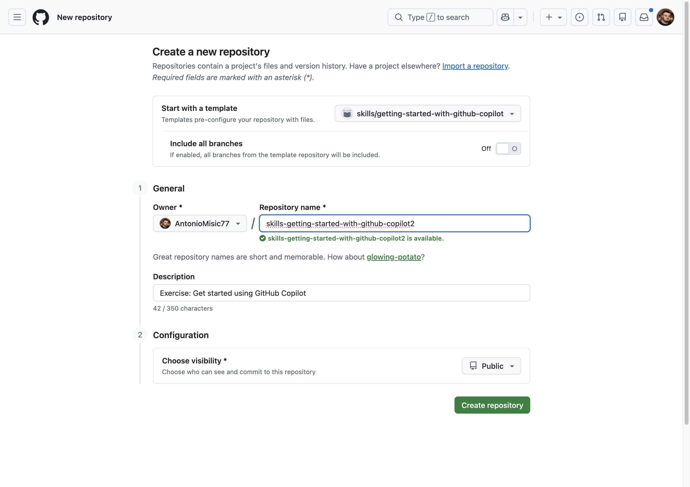
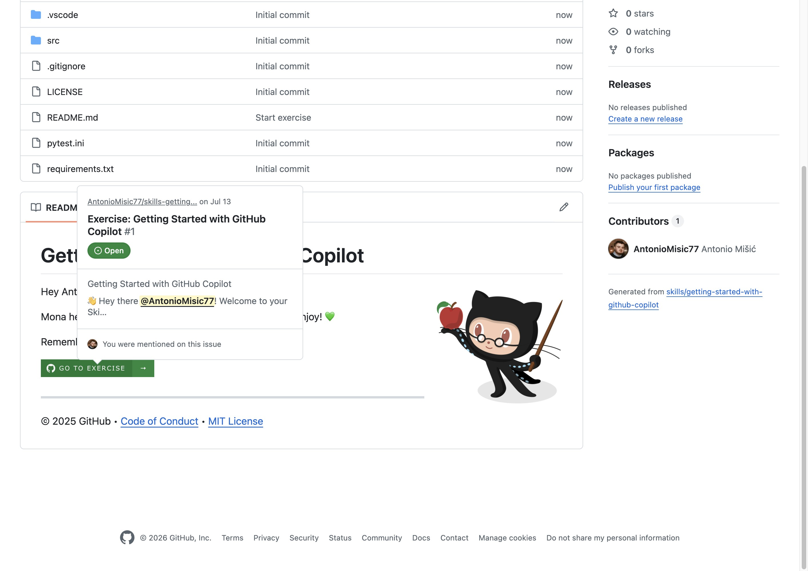
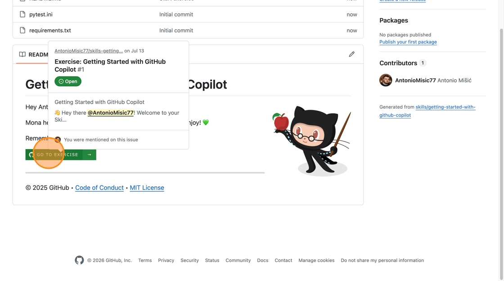
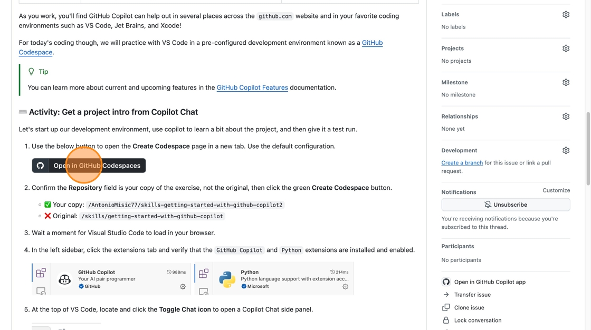
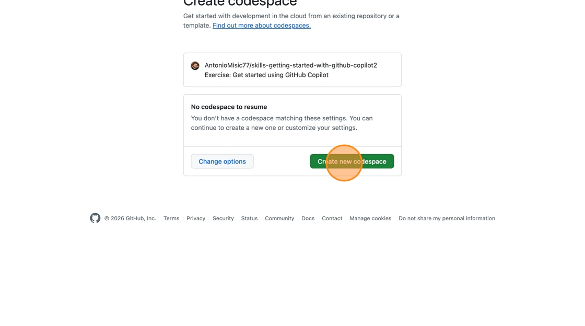
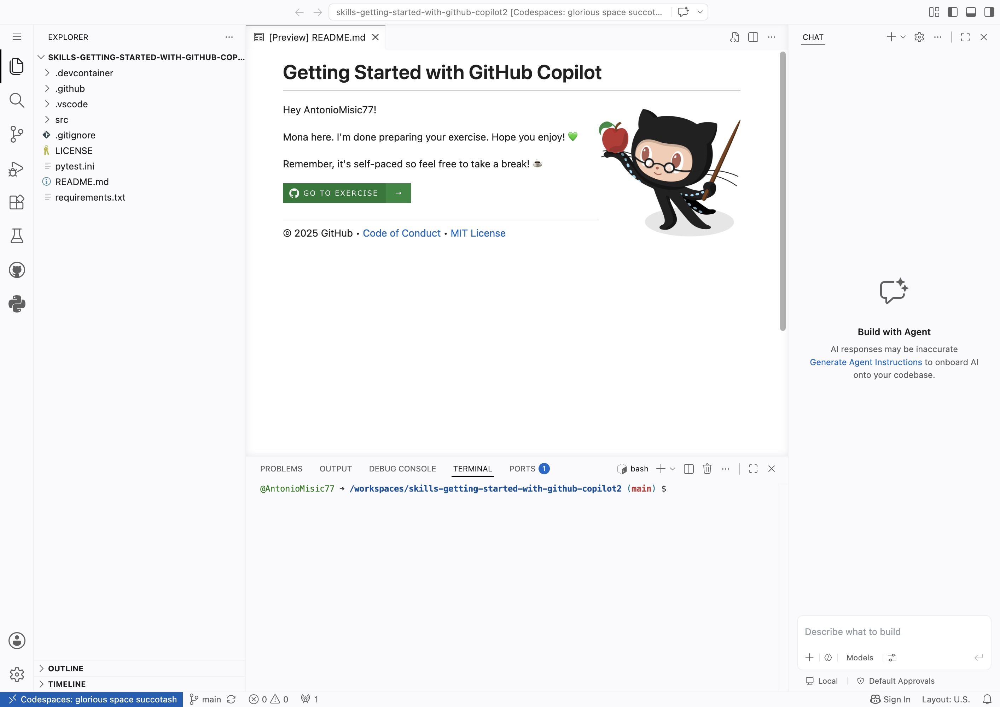
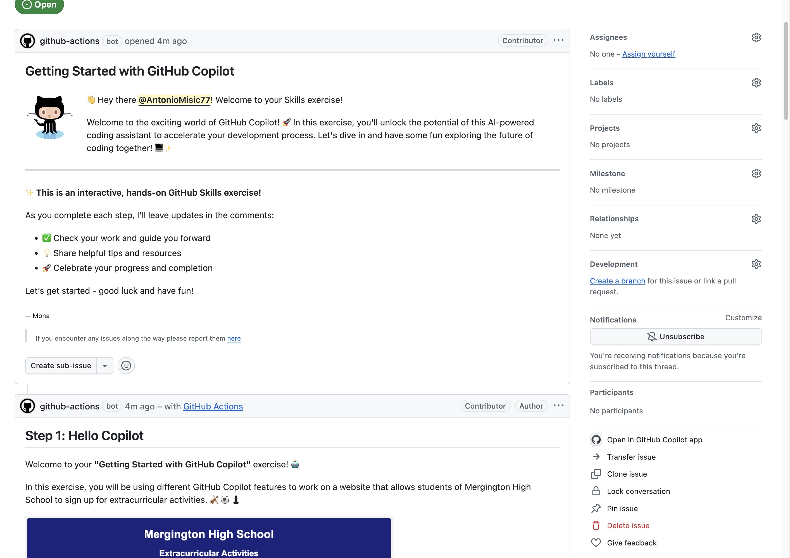

# Lab 1  Getting Started with GitHub Copilot

## Overview

This exercise walks you through your first hands-on experience with GitHub Copilot inside GitHub Codespaces — no local setup required.

**Estimated time:** 60 minutes

---

## What you will do

- Install GitHub Copilot using GitHub Codespaces
- Prompt GitHub Copilot for code suggestions
- Accept code suggestions from GitHub Copilot

---

## Instructions

1. Select the button below to open the exercise template repository on GitHub.

    [Start the exercise on GitHub](https://github.com/skills/getting-started-with-github-copilot){ .md-button .md-button--primary }

2. On the repository page, select the green **Copy Exercise** button to create your own copy.

    <figure markdown>
    { width="700" }
    <figcaption>Select "Copy Exercise" to start creating your copy</figcaption>
    </figure>

3. On the **Create a new repository** page, keep the suggested name (or choose your own), make sure **Public** is selected under **Choose visibility** — private repositories consume GitHub Actions minutes — then select **Create repository**.

    <figure markdown>
    { width="700" }
    <figcaption>Keep visibility set to Public before creating the repository</figcaption>
    </figure>

4. Wait about 20 seconds for Mona to prepare your exercise, then refresh the page. A GitHub Actions bot opens an issue titled **Exercise: Getting Started with GitHub Copilot #1** in your new repository.

    <figure markdown>
    { width="700" }
    <figcaption>Your new repository, with the exercise issue ready</figcaption>
    </figure>

5. From your repository's README, select **Go to Exercise** to open that issue — it contains your step-by-step instructions.

    <figure markdown>
    { width="700" }
    <figcaption>Select "Go to Exercise" to open the issue with your instructions</figcaption>
    </figure>

6. Inside the issue, select **Open in GitHub Codespaces**. This is a link, not the Codespace itself — it just takes you to a setup page in a new tab.

    <figure markdown>
    { width="700" }
    <figcaption>Step 1 in the issue: select "Open in GitHub Codespaces"</figcaption>
    </figure>

7. On the **Create codespace** tab that opens, confirm the repository shown is **your copy** (e.g. `<your-username>/skills-getting-started-with-github-copilot`, not `skills/...`), then select the green **Create new codespace** button.
    <figure markdown>
    { width="700" }
    <figcaption>Confirm the repository, then select "Create new codespace" to actually launch it</figcaption>
    </figure>

8. Wait a moment for VS Code to finish loading in your browser — this is your Codespace. In the left sidebar's Extensions tab, verify **GitHub Copilot** and **Python** are installed and enabled, then select the **Toggle Chat** icon at the top of the window to open the Copilot Chat side panel.

    <figure markdown>
    { width="700" }
    <figcaption>Your Codespace, with VS Code and Copilot Chat ready to use</figcaption>
    </figure>

9. Return to the issue tab and follow each numbered step (starting with **Step 1: Hello Copilot**) that Mona posts as comments. GitHub Actions checks your progress and unlocks the next step automatically.

    <figure markdown>
    { width="700" }
    <figcaption>Complete each step posted in the issue, in order</figcaption>
    </figure>

---

!!! note
    Do not modify any workflow files in the exercise repository. Altering them can break the validation, feedback, and grading steps.
